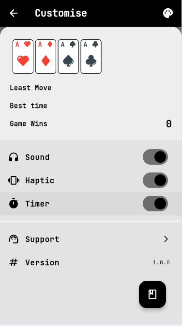

# 🃏 **Freecell** 🃏

Play **FreeCell Solitaire** online for free. Challenge your mind with this classic **FreeCell Solitaire** game! Simple game rules, multiple color themes, and unlimited undos! 🎮🧠

A classic **FreeCell** solitaire game built with Flutter.

> Forked from [guhhsle/freecell](https://github.com/guhhsle/freecell)

**🌐 Play Freecell Online!**: [https://freecell.ashin.top](https://freecell-game.top/)

---

## 🎯 **How to Play Freecell**

### 1. **Game Goal** 🏆

The goal of **FreeCell** is to move all the cards to the foundation piles, in **ascending order** (from Ace to King) and by **suit** (hearts, spades, diamonds, clubs). There are 4 foundation piles, one for each suit.

### 2. **Game Layout** 🃏

- The game starts with **52 cards** placed in **8 columns**.
- Each column may have one or more cards, with some cards face up and others face down.
- Use the **4 Free Cells** 🆓 to temporarily store cards while organizing the columns.

### 3. **Card Movement** 🔄

- You can move cards between columns if the card being moved is **one rank lower** and of the **opposite color** of the target card.
- You can also move cards to **Free Cells** to temporarily store them or place them in the foundation piles in ascending order.

### 4. **Winning the Game** 🏅

You win the game when all the cards are correctly placed in the **foundation piles** in ascending order (Ace to King) and sorted by suit.

---

## 💡 **Tips & Hints**

- Use **Free Cells** wisely to temporarily store cards.
- Plan your moves ahead of time and try to keep as many columns clear as possible.
- **Take your time** — there is no time limit! ⏳

---

## 🤔 **Need Support?**

Have a question or need help?  
We'd love to hear from you! 😄  
Send us a message and we’ll get back to you as soon as possible:

📧 **Email**: [783767826@qq.com](mailto:783767826@qq.com)  
🐙 **GitHub**: [flutter-freecell](https://github.com/AshinTop/flutter-freecell)

---

## 🎮 **Game Screenshots**

Here’s a preview of the game:

---

## 🚀 **Contribute to the Project**

Feel free to fork the repo and contribute! We welcome pull requests that help improve the game.

---

### 🌟 **Enjoy Playing FreeCell!**
